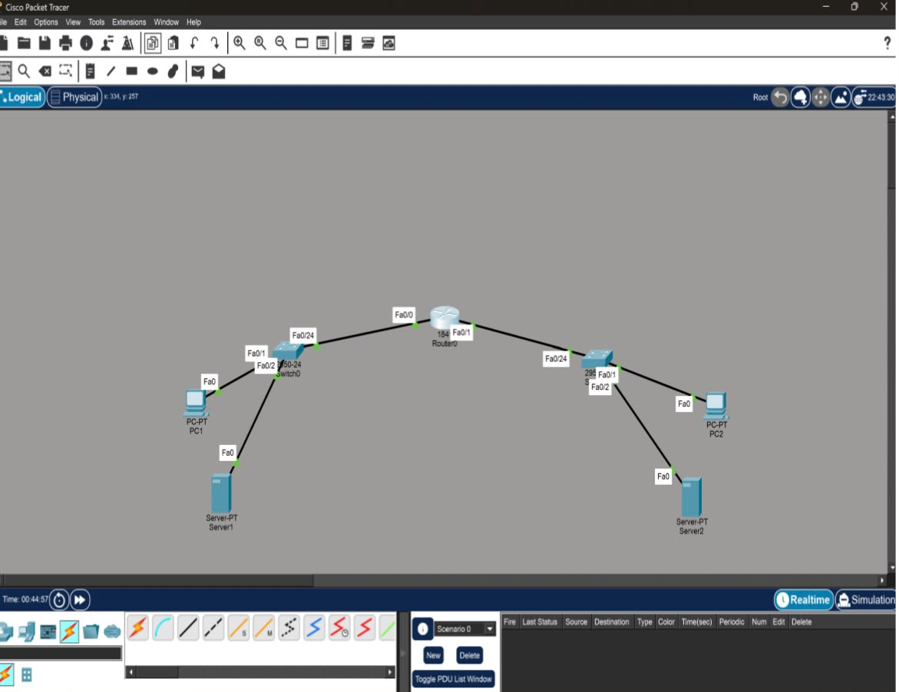
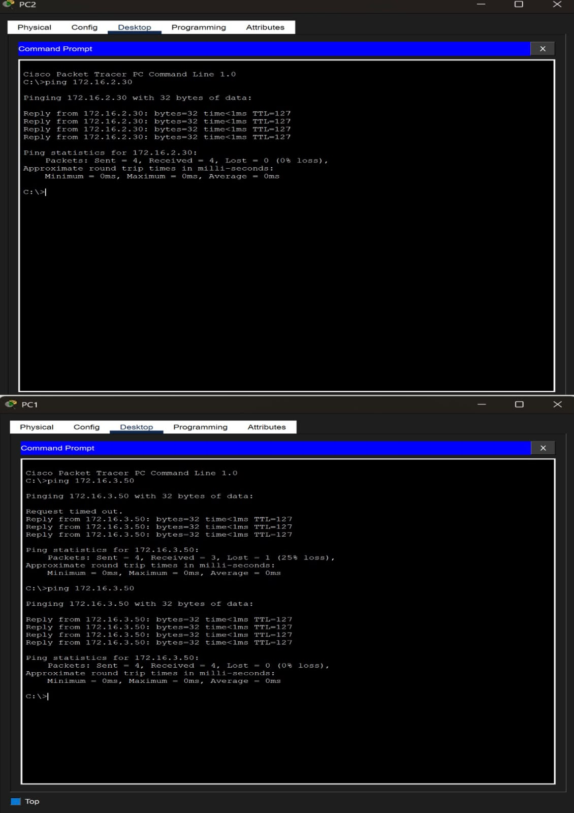
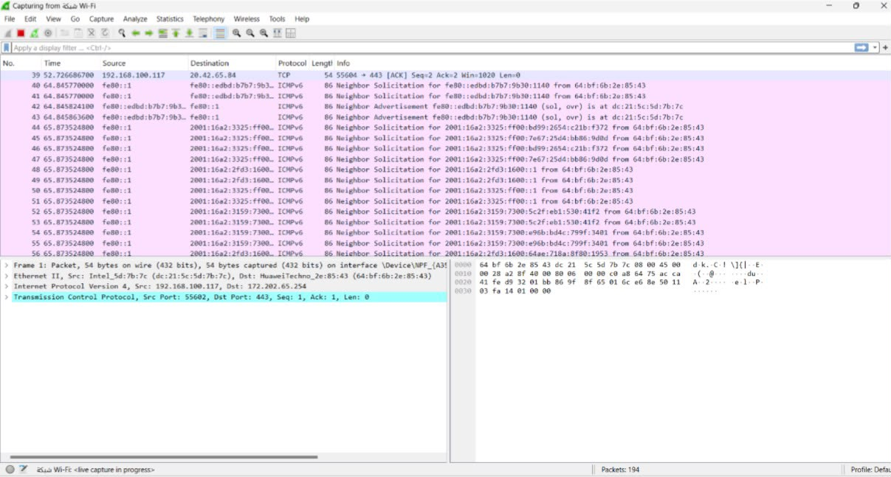

# Network Management Lab

A practical network management project using Cisco Packet Tracer and Wireshark. The project focuses on network configuration, connectivity testing, troubleshooting, and network traffic analysis.

## Project Overview

This project demonstrates the configuration and management of a small network consisting of two LANs connected through a router.

The network includes:
- Two LANs: `172.16.2.0/24` and `172.16.3.0/24`
- Router and switch configuration
- IPv4 addressing and default gateway configuration
- RIP routing configuration
- Connectivity testing between network devices
- Network troubleshooting and diagnostic tools
- Packet capture and traffic analysis using Wireshark

## Tools Used

- Cisco Packet Tracer
- Wireshark
- Cisco IOS CLI
- Windows Command Prompt

## Network Testing

Network connectivity and troubleshooting were performed using:

- `ping`
- `tracert`
- `nslookup`

## Traffic Analysis

Wireshark was used to capture, filter, and analyze network traffic, including:

- TCP
- HTTP/HTTPS
- ICMP
- ARP

## Project Files

The Cisco Packet Tracer `.pkt` file is included in this repository and contains the configured network topology.

## Skills Demonstrated

- Network Configuration
- IPv4 Addressing
- Routing
- Cisco IOS CLI
- Network Troubleshooting
- Packet Analysis
- Cisco Packet Tracer
- Wireshark

## Project Screenshots

### Network Topology

### Connectivity Testing

### Wireshark Traffic Analysis

